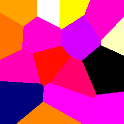

# Java Voronoi

This Java code creates 2D Voronoi diagrams including the traversable output graph of site polygons, edges, and vertices. Can be used for delauney triangulation as well.

## In Action

Here is a gif created by the project's VoronoiTest class using the input "svg f arf arf arf arf arf arf arf arf arf arf arf arf arf arf arf arf arf arf arf arf arf arf arf arf arf arf arf arf arf arf arf arf arf arf arf arf arf arf arf arf arf arf arf arf arf arf arf arf":

## Code Quality Note

I am using this code for my personal projects. I wrote all of it, but I did not clean it up for others to use.

## Bugs

The only bugs I am aware of are due to rounding errors and almost never show up. However, you can reliably recreate a scenario in which they show up by running the GUITestView, clicking in a about 8 places to create site dots and then holding enter/return. This will repeatedly relax the diagram and as the edges approach square the polygons will sometimes get whacky and send the centroid way off course.

## Pull Requests

I will, of course, look at all pull requests and potentially include them. I would love to work toward making this code a reliable and useful tool to as many programmers as possible.

## License

I am using the MIT license for this code. You may use the code as-is or modified in any project subject to the LICENSE.txt.
You must include a copy of this license in the documentation of any project that uses a subtantial portion of my code.
